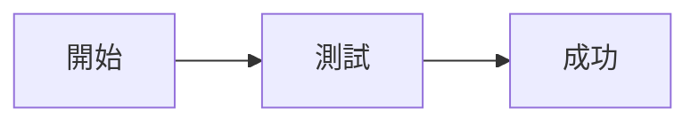
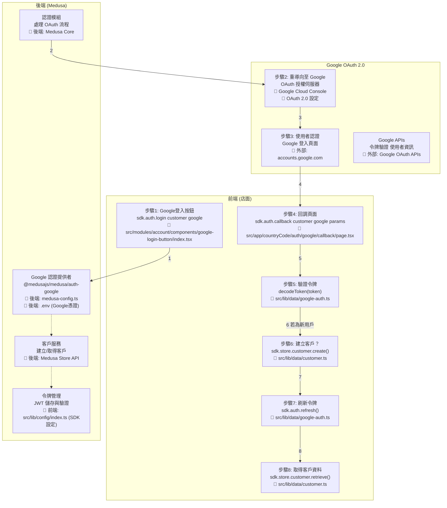

# Medusa Google 社群登入流程

## 測試 Mermaid 是否正常工作





## 實作檔案清單

### Frontend 主要檔案
- 📁 `src/modules/account/components/google-login-button/index.tsx`
- 📁 `src/app/[countryCode]/auth/google/callback/page.tsx`
- 📁 `src/lib/data/google-auth.ts`
- 📁 `src/lib/data/customer.ts`
- 📁 `src/lib/data/cookies.ts`
- 📁 `src/lib/config/index.ts` (SDK 配置)
- 📁 `Frontend/.env` (⚠️ 不需要 Google 憑證，只需要 Medusa 後端 URL)

### Backend 設定檔案

#### 📁 `Backend/medusa-config.ts`: Google Provider 設定
```typescript
import { Modules, ContainerRegistrationKeys } from "@medusajs/framework/utils"

module.exports = defineConfig({
  modules: [
    {
      [Modules.AUTH]: {
        resolve: "@medusajs/medusa/auth",
        dependencies: [Modules.CACHE, ContainerRegistrationKeys.LOGGER],
        options: {
          providers: [
            {
              resolve: "@medusajs/medusa/auth-google",
              id: "google",
              options: {
                clientId: process.env.GOOGLE_CLIENT_ID,
                clientSecret: process.env.GOOGLE_CLIENT_SECRET,
                callbackUrl: process.env.GOOGLE_CALLBACK_URL,
              },
            },
          ],
        },
      },
    },
  ],
})
```

#### 📁 `Backend/.env`: 環境變數設定（⚠️ 只需要在後端設定）
```env
# Google OAuth 憑證（從 Google Cloud Console 取得）
GOOGLE_CLIENT_ID=your_client_id
GOOGLE_CLIENT_SECRET=your_client_secret
GOOGLE_CALLBACK_URL=https://yourstore.com/auth/google/callback
```

#### 📁 `Frontend/.env`: SDK 連線設定（不需要 Google 憑證）
```env
# 只需要 Medusa 後端連線資訊
NEXT_PUBLIC_MEDUSA_BACKEND_URL=http://localhost:9000
NEXT_PUBLIC_BASE_URL=http://localhost:3000
# ❌ 不需要 GOOGLE_CLIENT_ID 等 Google 憑證
```

### Google Cloud Console
- OAuth 2.0 憑證設定
- 授權重新導向 URI 設定

## 流程確認與實作步驟

### ✅ 流程圖與實作完全吻合！

#### 步驟1: Google登入按鈕點擊
- **實作**: 呼叫 `sdk.auth.login("customer", "google", {})`
- **檔案**: `src/modules/account/components/google-login-button/index.tsx`
- **說明**: 如果回傳 `location`，將使用者導向 Google 認證頁面

#### 步驟2: 重導向至 Google
- **實作**: Medusa 後端處理 OAuth 流程
- **檔案**: 後端 `medusa-config.ts` (Google Provider 設定)
- **說明**: 自動重導向到 Google OAuth 授權伺服器

#### 步驟3: 使用者在 Google 認證
- **實作**: 使用者在 Google 登入頁面進行認證
- **檔案**: 外部服務 `accounts.google.com`
- **說明**: Google 處理使用者認證並產生授權碼

#### 步驟4: Callback 頁面處理
- **實作**: 呼叫 `sdk.auth.callback("customer", "google", queryParams)`
- **檔案**: `src/app/[countryCode]/auth/google/callback/page.tsx`
- **說明**: Google 帶著 code 和 state 參數 redirect 回來，取得 token

#### 步驟5: 驗證令牌
- **實作**: 使用 `decodeToken(token)` 檢查 `actor_id`
- **檔案**: `src/lib/data/google-auth.ts`
- **說明**: 判斷是否為新用戶 (`actor_id === ""`)

#### 步驟6: 建立新客戶（若需要）
- **實作**: 若為新用戶，呼叫 `sdk.store.customer.create()`
- **檔案**: `src/lib/data/customer.ts`
- **說明**: 只有第一次登入時才需要建立客戶資料

#### 步驟7: 刷新令牌
- **實作**: 呼叫 `sdk.auth.refresh()` 取得完整權限
- **檔案**: `src/lib/data/google-auth.ts`
- **說明**: 建立客戶後需要刷新 token 以取得完整認證

#### 步驟8: 取得客戶資料
- **實作**: 呼叫 `sdk.store.customer.retrieve()` 完成登入
- **檔案**: `src/lib/data/customer.ts`
- **說明**: 取得完整的客戶資料，完成登入流程

## 前端核心實作程式碼

### 📁 `src/modules/account/components/google-login-button/index.tsx`
```typescript
const loginWithGoogle = async () => {
  const result = await sdk.auth.login("customer", "google", {})
  if (typeof result === "object" && result.location) {
    window.location.href = result.location
    return
  }
  if (typeof result !== "string") {
    alert("Authentication failed")
    return
  }
  // 已經登入過，直接取得 customer 資料
  const { customer } = await sdk.store.customer.retrieve()
  console.log(customer)
}
```

### 📁 `src/app/[countryCode]/auth/google/callback/page.tsx`
```typescript
import { decodeToken } from "react-jwt"
import { sdk } from "@/lib/sdk"

const sendCallback = async () => {
  let token = ""
  try {
    token = await sdk.auth.callback("customer", "google", queryParams)
  } catch (error) {
    alert("Authentication Failed")
    throw error
  }
  return token
}

const validateCallback = async () => {
  const token = await sendCallback()
  const shouldCreateCustomer = (decodeToken(token)).actor_id === ""
  if (shouldCreateCustomer) {
    await sdk.store.customer.create({ email: "example@medusajs.com" })
    await sdk.auth.refresh()
  }
  const { customer: customerData } = await sdk.store.customer.retrieve()
  setCustomer(customerData)
  setLoading(false)
}
```

## 🔧 環境變數遷移指南

### ✅ 你的理解完全正確！

**需要做的調整：**

1. **將前端的 Google 憑證移到後端**：
   ```bash
   # 從 Frontend/.env 移除
   # GOOGLE_CLIENT_ID=xxx
   # GOOGLE_CLIENT_SECRET=xxx
   
   # 移到 Backend/.env
   GOOGLE_CLIENT_ID=xxx
   GOOGLE_CLIENT_SECRET=xxx
   GOOGLE_CALLBACK_URL=https://yourstore.com/auth/google/callback
   ```

2. **前端只保留 Medusa 連線設定**：
   ```env
   # Frontend/.env
   NEXT_PUBLIC_MEDUSA_BACKEND_URL=http://localhost:9000
   NEXT_PUBLIC_BASE_URL=http://localhost:3000
   ```

3. **原因說明**：
   - Google OAuth 流程完全在 Medusa 後端處理
   - 前端透過 Medusa SDK 與後端溝通，不直接與 Google API 互動
   - 這樣更安全，避免在前端暴露敏感的 Google 憑證

## 套件安裝
```bash
npm install @medusajs/js-sdk react-jwt google-auth-library
```